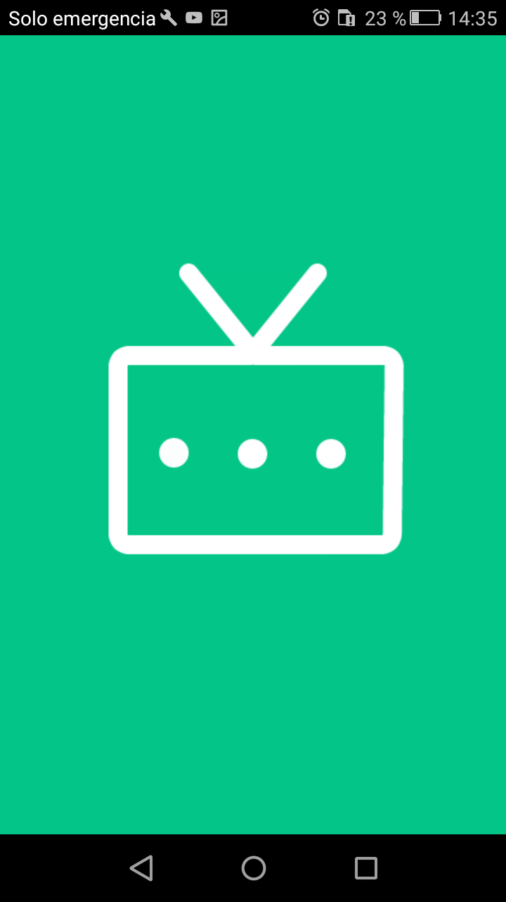
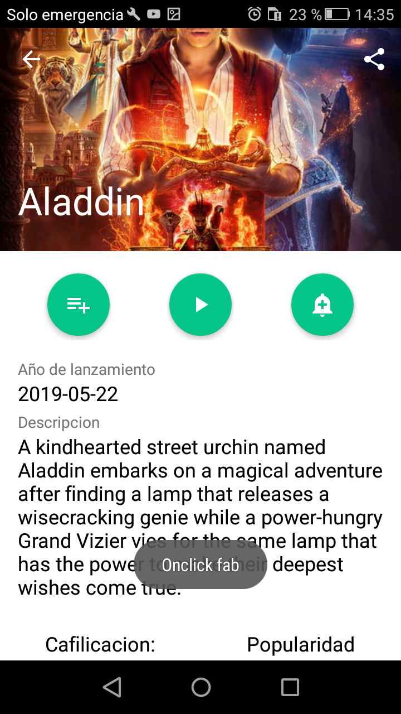
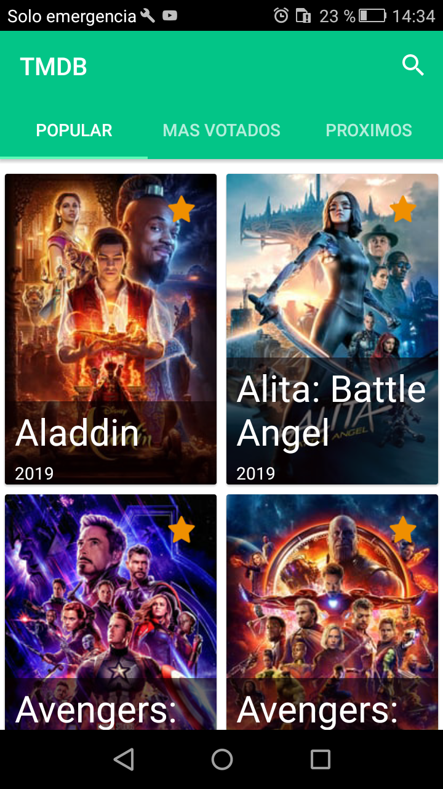

# App (TMDb) - MVP 

Aplicación Android basada en el API de themoviedb, para la consulta de series y películas de la plataforma, esta aplicación cuenta con una arquitectura MVP, almacenando los datos en una tabla Sqlite para su uso Offline. 

## ARQUITECTURA MVP

Cada modulo cuenta con una arquitectura Modelo Vista Presentador (MPV), donde el presentador asume toda la lógica de negocio  alimentando la vista con los datos del modelo.
	
	* Modelo - Capa para el control de los datos que se muestra o no en la interfaz.
	* Vista - Es una clase interfaz la cual  exhibe los datos al usuario y captura las ordenes de este .	
	* Presentador - Intermediario para conectar los datos con la vista, es la capa intermedia en la arquitectura.

## Herramientas:

* [Volley](https://github.com/google/volley) - Librería Http, conexión del API con la aplicación.
* [lottie-android](https://github.com/airbnb/lottie-android) - Gestor de animaciones.
* [Picasso](https://square.github.io/picasso/) - Gestor de Imágenes.
* [SQLite](https://www.sqlite.org/index.html) - Gestor de Base de datos.

## OffLine
Se crea una tabla en [SQLite](https://www.sqlite.org/index.html) para almacenar las series y películas  en la carga inicial. la aplicación es capas de detectar si cuenta con Internet y si es así actualiza los datos realizando la petición http.

## Versión
	* Versión 0.0.1-beta
		

## En qué consiste el principio de responsabilidad única? Cuál es su propósito?

	* En ingeniería de software la responsabilidad única consiste en que cada modulo este separado y dependa de si solo para su correcto funcionamiento.

	* Su propósito principal es que el código fuente sea mas limpio y flexible para su mantenimiento. 

## Qué características tiene, según su opinión, un “buen” código o código limpio?

Las principales características que debe tener un código limpio son 

	* Lineamiento de  una arquitectura 
	* Patrones de diseño
    * Estándares según el lenguaje 
    * Comentarios asertivos 
    * legible	

## Instalador
* [Descargar](https://www.amazon.com/clouddrive/share/VnhgVkPoV56iW4g59PqQU0xlF7KtJLBV0BzkHPq6CEt)

## Screenshot

## Autor

* **Santiago Sepulvbeda** - *Desarrollador Android* - [web](https://ssepulveda08.github.io/Santiagoweb/)
